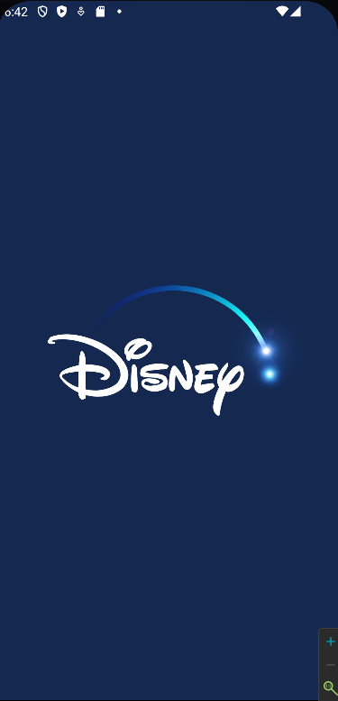
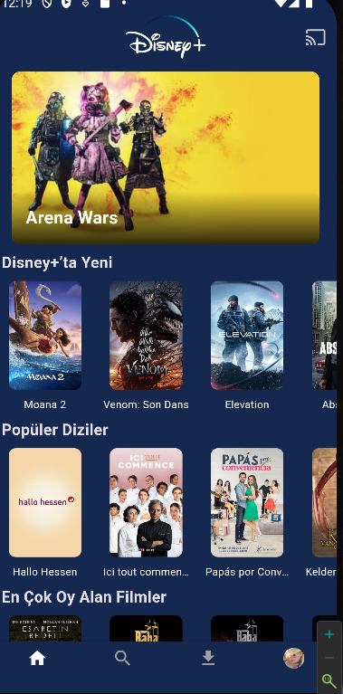
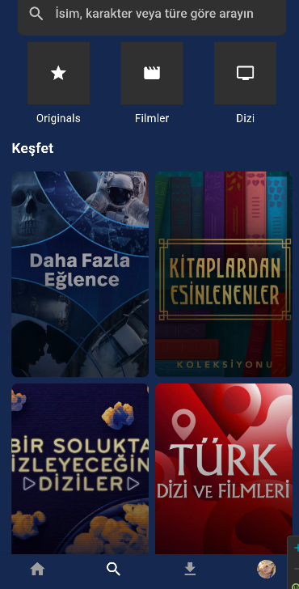
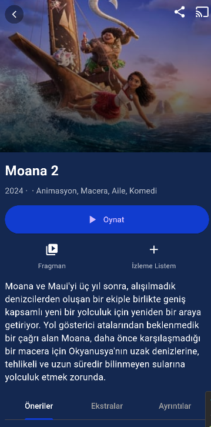
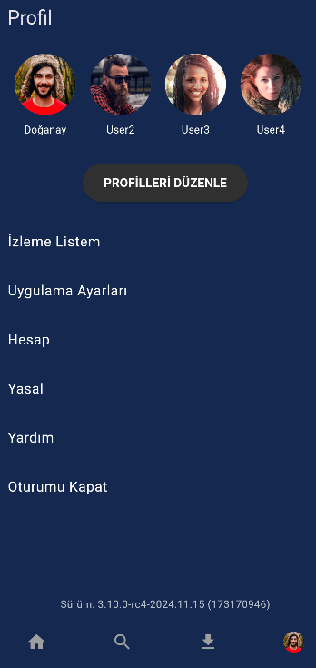

# Disney+ Clone

Bu proje, Flutter kullanarak Disney+ uygulamasının bir klonunu oluşturan bir mobil uygulama geliştirme çalışmasıdır. Proje, modern tasarım prensipleri ve Flutter'ın güçlü özelliklerini kullanarak hem görsel açıdan çekici hem de işlevsel bir kullanıcı deneyimi sunar.

## 📱 Ekran Görüntüleri

| Açılış Ekranı                 | Ana Ekran                     | Arama Ekranı                  |
|-------------------------------|-------------------------------|-------------------------------|
|  |  |  |

| Film Detay Ekranı             | Profil Seçim Ekranı           |
|-------------------------------|-------------------------------|
|  |  |

## 🚀 Özellikler

- **Splash Screen**: Animasyonlu bir açılış ekranı (Disney animasyonu ve ses efekti içerir).
- **Profil Yönetimi**: Kullanıcıların profil eklemesi ve seçmesi.
- **NavBar**: Kullanıcıların sayfalar arası kolay bir şekilde geçmesi.
- **Film ve Dizi Detayları**: TMDb API'si kullanılarak detaylı bilgi sağlama.
- **Arama Özelliği**: Filmler ve diziler için gelişmiş arama.
- **Kategori Göstergesi**: Popüler, yüksek oy alan ve yeni içerikleri listeleme.
- **Dinamik TabBar**: Film ve dizi türüne göre dinamik sekme yönetimi.

## 📦 Kullanılan Teknolojiler ve Kütüphaneler

- **Flutter**: UI geliştirme.
- **Dart**: Flutter için programlama dili.
- **TMDb API**: Film ve dizi bilgileri için.
- **Lottie Animations**: Animasyonlu açılış ekranı.
- **audioplayers**: Ses efektleri için.
- **cached_network_image**: Görüntülerin önbelleğe alınması.
- **carousel_slider**: Karusel bileşeni için.
- **animated_splash_screen**: Açılış animasyonu için.


🛠️ Kurulum
Projeyi klonlayın:

bash
Kodu kopyala
git clone https://github.com/doganaytay1097/disney_plus_clone.git
cd disney_plus_clone
Bağımlılıkları yükleyin:

bash
Kodu kopyala
flutter pub get
TMDb API Anahtarını Ekleyin: tmdb_service.dart dosyasındaki apiKey değişkenine kendi TMDb API anahtarınızı ekleyin.

Uygulamayı çalıştırın:

bash
Kodu kopyala
flutter run

## 📂 Proje Yapısı

```plaintext
lib/
├── main.dart                # Ana uygulama dosyası
├── screens/                 # Uygulama ekranları
│   ├── home_screen.dart     # Ana ekran
│   ├── main_screen.dart     # Navigation Bar ekranı
│   ├── search_screen.dart   # Arama ekranı
│   ├── details_screen.dart  # Film/Dizi detay ekranı
│   ├── profile_screen.dart  # Profil ekranı
│   ├── profile_selection_screen.dart  # Profil seçimi ekranı
│   └── downloads_screen.dart  # İndirilenler ekranı
├── services/                # API servisleri
│   └── tmdb_service.dart    # TMDb API servisi
├── assets/                  # Proje varlıkları
│   ├── animations/          # Lottie animasyon dosyaları
│   ├── images/              # Görseller
│   └── audio/               # Ses dosyaları


